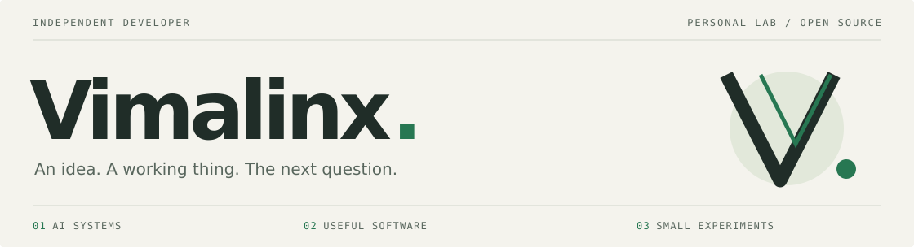

<picture>
  <source media="(prefers-color-scheme: dark)" srcset="assets/header-dark.svg">
  <source media="(prefers-color-scheme: light)" srcset="assets/header-light.svg">
  
</picture>

**七叶怀瑾 / Vimalinx** · 独立开发者

把想法做成能用的软件。最近主要在做 **VimalinxOS**，探索怎样让 AI 在自己的电脑上理解环境、操作工具、验证结果，把事情做完。

I build tools for AI agents and the people working alongside them.

[个人网站](https://vimalinx.com) &nbsp; / &nbsp; [全部仓库](https://github.com/vimalinx?tab=repositories) &nbsp; / &nbsp; [VimalinxOS](https://github.com/vimalinx/VimalinxOS)

## 正在构建 · VimalinxOS

### [让 AI 能在自己的电脑上，把事情做完 ↗](https://github.com/vimalinx/VimalinxOS)

一组面向人和 AI Agent 的 Linux 开源基础设施。从模型与 API，到会话、浏览器和桌面应用，再到能持续接班的工作区。组件分别开发和发布，也可以独立使用。

| 项目 | 解决的问题 |
| :--- | :--- |
| [**LocalRouter**](https://github.com/vimalinx/LocalRouter) | 把模型 API 与服务接到本机，让 Agent 发现并调用。 |
| [**AgentSeat**](https://github.com/vimalinx/AgentSeat) | 给 Agent 独立的应用操作席位，保留人的鼠标与焦点。 |
| [**枢衡 Shuheng**](https://github.com/vimalinx/Shuheng) | 管理本地 Agent 会话、执行与长期工作。 |
| [**Vibe Desktop**](https://github.com/vimalinx/vibedesktop) | 把本地 Web 应用组织成一个可用的桌面。 |

[浏览完整的 9 个开源项目 →](https://github.com/vimalinx/VimalinxOS#开源项目)

## 也做一些小工具

**[VibeMouse ↗](https://github.com/vimalinx/VibeMouse)** &nbsp; 按住鼠标侧键说话，让语音输入接上 Linux 上的日常开发。

**[CaptchaMesh ↗](https://github.com/vimalinx/CaptchaMesh)** &nbsp; Agent 遇到需要人处理的验证码时，把请求交到 Android 手机，再把结果传回。

---

Linux / Hyprland · Python / Go / TypeScript &nbsp;&nbsp;｜&nbsp;&nbsp; 也关心生物信息、学习工具、创作，以及一杯好茶。
