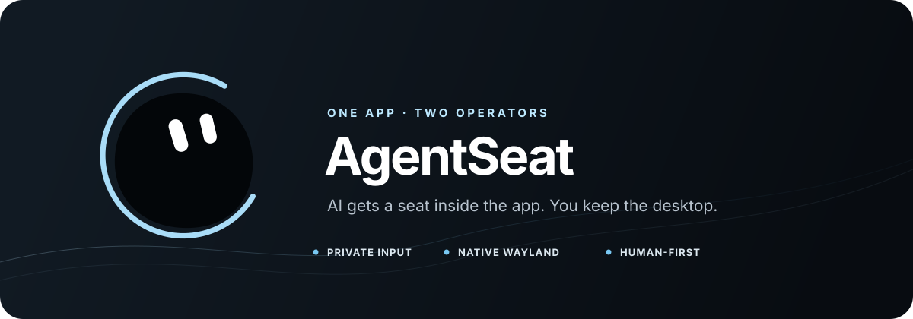

<a href="https://github.com/vimalinx/VimalinxOS">
  <picture>
    <source media="(max-width: 600px)" srcset="https://raw.githubusercontent.com/vimalinx/vimalinx/3f00a635b13654468ce65c971b576790d3a6d327/assets/profile-hero-mobile.svg">
    
  </picture>
</a>

  <strong>把想法做成能用的软件，也给技术留一点生活的气息。</strong> 
  Independent developer · AI agents · Linux · Learning &amp; creative tools

  <a href="https://vimalinx.com">个人网站</a> &nbsp; / &nbsp;
  <a href="https://github.com/vimalinx/VimalinxOS">VimalinxOS</a> &nbsp; / &nbsp;
  <a href="https://github.com/vimalinx?tab=repositories">全部开源项目</a>

 

最近的主要工作是 **VimalinxOS**。希望人表达目标后，Agent 能发现可用能力、调用工具、操作应用、检查结果，并在出错后继续诊断和恢复。

这些能力由独立项目提供。总览仓库收录了 **9 个已公开的项目**，各自开发与发布。

**[进入 VimalinxOS →](https://github.com/vimalinx/VimalinxOS)** &nbsp; · &nbsp; [查看完整项目清单](https://github.com/vimalinx/VimalinxOS#开源项目)

 

公开演示环境截图 · 虚构示例数据 · 每 6 秒切换一个页面

**[LocalRouter ↗](https://github.com/vimalinx/LocalRouter)** &nbsp; 模型 API、服务接口和调用身份集中在本机管理，让 Agent 查询能力，再选择具体操作。

[了解项目](https://github.com/vimalinx/LocalRouter#readme) &nbsp; · &nbsp; [下载发行版](https://github.com/vimalinx/LocalRouter/releases)

 

**[AgentSeat ↗](https://github.com/vimalinx/AgentSeat)** &nbsp; 在一个普通应用中，给 Agent 自己的观察入口、鼠标和键盘，同时保留人的宿主焦点与输入。

 

### 继续逛逛

| 项目 | 从一个具体问题出发 |
| :--- | :--- |
| [**枢衡 Shuheng**](https://github.com/vimalinx/Shuheng) | 本地 Agent 的会话、执行和长期工作，放进一个终端控制面。 |
| [**Vibe Desktop**](https://github.com/vimalinx/vibedesktop) | 把本地 Web 应用组织成一个可用的桌面。 |
| [**VibeMouse**](https://github.com/vimalinx/VibeMouse) | 按住鼠标侧键说话，让语音输入接上 Linux 开发。 |
| [**CaptchaMesh**](https://github.com/vimalinx/CaptchaMesh) | 把需要人处理的验证码交到 Android 手机，再将结果传回 Agent。 |
| [**AI Workspace Template**](https://github.com/vimalinx/ai-workspace-template) | 让项目的状态、证据和决定能跨 Agent 会话接续。 |

 

   
  AI、Linux、学习与创作。以及，一杯好茶。

